### Working with count data

### Poisson and Quasipoisson

These models can be used for predicting counts. Poisson model has the assumption that mean is equal variance, if that condition is not hold, we can use quasipoisson model.

**glm(formula, data, family) **

**glm(y ~ x1 + x2 + x3, dataset, family = quasipoisson)**

### Generalized additive model (GAM)

If we are not sure about the nonlinear relationship between independent and dependent variable, we can use GAM to learn the nonlinear nature of the relationship.

In the **gam()** function, we can use family = gaussian for regular regression, binomial for probabilities and poisson/quasipoisson for count data.

```{r}
# library(mgcv)
# gam(dependent ~ s(independent), data = train, family = gaussian)
```

We use **s()** to denote that there is a nonlinear relationship etween this predictor variable and reponse variable. We can't use **s()** with categorical variable.

### Machine Learning

"Machine learning is a field of artificial intelligence that uses statistical techniques to give computer systems the ability to "learn" (e.g., progressively improve performance on a specific task) from data, without being explicitly programmed." -- Wikipedia

Given input and output data, it wants to estimate the function that best emulate or approximaes the relationship between them that lead to the response. 


Today, we will cover supervised machine learning.

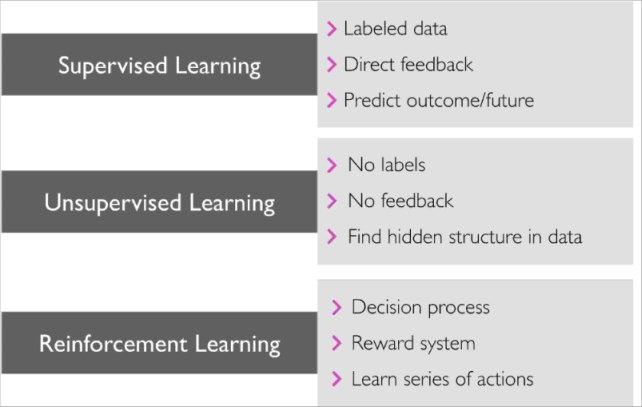

#### So, have we covered any of ML so far, what is your take?

### Some common machine learning tasks:

* Classification
* Regression
* Clustering

### Bias/variance trade off

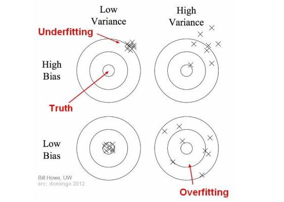

High bias results in underfitting and low variance and low bias results in overfitting (or close to) which will have high variance.

### Training, test and validation data

* Training data: The model is initially fit on a training dataset.
* Validation data: this dataset is used to predict the response of the obsservations. This dataset can be used more than once for model selection among other competing models.
* Test data: We evaluate our model by fitting it on test data for once.


#### Cross-validation: techniques for assessing how the results of a statistical analysis will generalize to an independent data set. It estimates the skill of a machine learning model on unseen data.

#### k-Fold Cross-Validation


### Creating training and testing data

```{r}
library(ISLR)
names(Smarket)
library(rpart)

# Shuffle the dataset; build train and test
n = nrow(Smarket)
shuffled = Smarket[sample(n),]
train = shuffled[1:round(0.7 * n),]
test = shuffled[(round(0.7 * n) + 1):n,]


tree = rpart(Direction ~ ., train, method = "class")

# Predict the outcome
pred = predict(tree, test, type = "class")

# Calculate the confusion matrix: conf
conf = table(test$Direction, pred)

# Print this confusion matrix
print(conf)
```

100% accuracy!?

Let's work with Carseats dataset now.

```{r}
library(ISLR)
attach(Carseats)
library(tidyverse)
Carseats = Carseats %>%
  mutate(High = ifelse(Sales <= 8, "No", "Yes"))

# Shuffle the dataset; build train and test
n = nrow(Carseats)
shuffled = Carseats[sample(n),]
train = shuffled[1:round(0.7 * n),]
test = shuffled[(round(0.7 * n) + 1):n,]
tree = rpart(High~.-Sales, train, method = "class")
pred = predict(tree, test, type = "class")
conf = table(test$High, pred)
print(conf)
# Accuracy
sum(diag(conf))/sum(conf)
```

#### 6-fold cross validation

We will use 6-fold cross validation and calculate the accuracy for each fold. The mean of these accuracies is a robust estimation of the model's true accuracy in predicting unseen data.

```{r}
set.seed(1)
holder = rep(0,6)
for (i in 1:6) {
  # Interval of the test set
  indices = (((i-1) * round((1/6)*nrow(shuffled))) + 1):((i*round((1/6) * nrow(shuffled))))
  train = shuffled[-indices,]
  test = shuffled[indices,]
  tree = rpart(High~.-Sales, train, method = "class")
  pred = predict(tree, test, type = "class")
  conf = table(test$High, pred)
  holder[i] = sum(diag(conf))/sum(conf)
}
mean(holder)
```


### Decision tree

```{r}
library(rpart)
library(rattle)
library(rpart.plot)
library(RColorBrewer)
```

```{r}
fancyRpartPlot(tree)
```

### Pruning the tree

```{r}
tree = rpart(High~.-Sales, train, method = "class", control = rpart.control(cp=0.10))
fancyRpartPlot(tree)
```

### k-nearest neighbor

Consideration: Normalize data first

We will consider data for stock data upto 2004 for training and data after 2005 as test data. 

**knn(predicors of training data, predictors of test data, vector of class labels for training oservations, number of narest neighbors)**

```{r}
library(dplyr)

train_knn = Smarket %>%
  filter(Year < 2005) %>%
  select(Lag1, Lag2)

test_knn = Smarket %>%
  filter(Year >= 2005)%>%
  select(Lag1, Lag2)

train_labels_knn = Smarket %>%
  filter(Year < 2005) %>%
  select(Direction) %>%
  .$Direction # returns the class labels as a vector rather than a dataframe

test_labels_knn = Smarket %>%
  filter(Year >= 2005) %>%
  select(Direction) %>%
  .$Direction # returns the class labels as a vector rather than a dataframe

library(class)
pred = knn(train = train_knn, test = test_knn, cl = train_labels_knn, k = 5)
# Confusion matrix
(conf = table(test_labels_knn, pred))
```

### Which k to choose?

```{r}
#train_labels = train$High
#test_labels = test$High
library(class)
range = 1:round(0.1 * nrow(train_knn))
accuracy = rep(0, length(range))
for (k in range) {
  pred = knn(train = train_knn, test = test_knn, cl = train_labels_knn, k = k)
  # confusion matrix
  conf = table(test_labels_knn, pred)
  # accuracy
  accuracy[k] = sum(diag(conf)) / sum(conf)
}

# Plot the accuracies. Title of x-axis is "k".
plot(range, accuracy, xlab = "k")

# Calculate the best k
which.max(accuracy)
```

Let's run again with new k.

```{r}
pred = knn(train = train_knn, test = test_knn, cl = train_labels_knn, k = 72)
# Confusion matrix
(conf = table(test_labels_knn, pred))
# Accuracy
sum(diag(conf)) / sum(conf)
```


The one that gives most accuracy.

### Can we measure the accuracy and conduct a 6-fold cross validation on this knn model?

### Receiver Operator Characteristic Curve

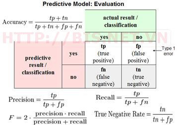

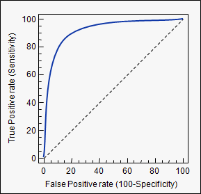

### Creating ROC curve

```{r}
library(rpart)
tree = rpart(High~.-Sales, train, method = "class")
probs = predict(tree, test, type = "prob")[,2]
library(ROCR)
#train$High = ifelse(train$High == "Yes", 1, 0)
# test$High2 = ifelse(test$High == "Yes", 1, 0)
# pred = prediction(probs, test$High2)
#perf = performance(pred,  "tpr", "fpr")
# # AUC
# plot(perf)
```


### Regression trees

```{r}
library(tree)
library(MASS)
set.seed(1)
n = nrow(Boston)
shuffled = Boston[sample(n),]
train_boston = shuffled[1:round(0.7 * n),]
test_boston = shuffled[(round(0.7 * n) + 1):n,]
tree.boston = rpart(medv~., train_boston, method = "anova")
rpart.plot(x = tree.boston, yesno = 2, type = 0, extra = 0)
```


Let's work with decision tree again.

```{r}
tree = rpart(High~.-Sales, data = train, method = "class", control = rpart.control(cp=0.10))
```

We will get the confusion matrix now:

```{r}
Carseats = Carseats %>%
  mutate(High = ifelse(Sales <= 8, "No", "Yes"))

# We need to convert to factors the reponse variable
Carseats$High = as.factor(Carseats$High)

# Shuffle the dataset; build train and test
n = nrow(Carseats)
shuffled = Carseats[sample(n),]
train = shuffled[1:round(0.7 * n),]
test = shuffled[(round(0.7 * n) + 1):n,]

# Predict classes
class_prediction = predict(object = tree,  
                        newdata = test,  
                        type = "class")       
                            
library(caret)
# Confusion matrix
confusionMatrix(data = class_prediction,         
                reference = test$High) 
```

### Impurity measures

* Entropy

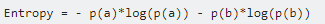

Information gain = 1 - Impurity

* Gini Index

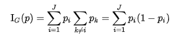

### Compare models with different impurity measures or splitting criterion

```{r}
# Gini
gini_model = rpart(formula = High~.-Sales, 
                       data = train, 
                       method = "class",
                       parms = list(split = "gini"))

# Information gain
information_model = rpart(formula = High~.-Sales, 
                       data = train, 
                       method = "class",
                       parms = list(split = "information"))

# Generate predictions on the validation set using the gini model
pred_gini = predict(object = gini_model,
                 newdata = test,
                 type = "class")    

# Generate predictions on the validation set using the information model
pred_information = predict(object = information_model, 
                 newdata = test,
                 type = "class")

library(Metrics)
# Compare classification error
ce(actual = test$High, 
     predicted = pred_gini)
ce(actual = test$High, 
     predicted = pred_information)
```

### Pruning tree

```{r}
pruned = prune(tree, cp = 0.01)

# Draw pruned
fancyRpartPlot(pruned)
```

###  Cost-complexity parameter

```{r}
plotcp(pruned)
```

### Retrieve optimal cp value and use it to fit a CART

```{r}
# Optimal cp value
opt_index = which.min(tree$cptable[, "xerror"])
cp_opt = tree$cptable[opt_index, "CP"]

# Prune the model
tree_opt = prune(tree = tree, 
                         cp = cp_opt)
                          
# Plot the optimized model
rpart.plot(x = tree_opt, yesno = 2, type = 0, extra = 0)
```

### Bootstrap aggregation or Bagging

```{r}
library(ipred)
set.seed(123)
bagging_model = bagging(formula = High~.-Sales, 
                        data = train,
                        coob = TRUE)

# Print the model
print(bagging_model)
```

#### Prediction

```{r}
(class_prediction = predict(object = bagging_model, 
                            newdata = test,  
                            type = "class"))
```

#### Confusion matrix

```{r}
# Confusion matrix for the test set
confusionMatrix(data = class_prediction,         
                reference = test$High)  
```

### Gradient boosting

```{r}
library(gbm)
# Convert "yes" to 1, "no" to 0

# Shuffle the dataset; build train and test
n = nrow(Carseats)
shuffled = Carseats[sample(n),]
train = shuffled[1:round(0.7 * n),]
test = shuffled[(round(0.7 * n) + 1):n,]

train$High = ifelse(train$High == "Yes", 1, 0)

# Train on 300 trees for GBM
set.seed(1)
gbm_model = gbm(formula = High~.-Sales, 
                    distribution = "bernoulli", 
                    data = train,
                    n.trees = 10000)
                
print(gbm_model) 

# variable importance
summary(gbm_model)
```

Predict on the data

```{r}
predict(gbm_model, type = "response", n.trees = 10000)
```

### Predict on test data

```{r}
pred_val = predict(object = gbm_model, 
                  newdata = test,
                  n.trees = 10000,
                  type = "response")
```


### GBM hyperparameters

```{r}
# train a GBM model
train$High = ifelse(train$High == "Yes", 1, 0)
test$High = ifelse(test$High == "Yes", 1, 0)
```

```{r}
# Optimal tree size based on CV error
#ntree_opt_cv = gbm.perf(gbm_model, method = "cv")
```

```{r}
# Optimal ntree based on OOB error
ntree_opt_oob = gbm.perf(gbm_model, method = "OOB")
```

```{r}
pred = predict(object = gbm_model, 
                  newdata = test,
                  n.trees = ntree_opt_oob)
```


### Random forest

```{r}
library(randomForest)
set.seed(1)
n = nrow(Carseats)
shuffled = Carseats[sample(n),]
train = shuffled[1:round(0.7 * n),]
test = shuffled[(round(0.7 * n) + 1):n,]
(rf_model = randomForest(formula = High~.-Sales, 
                    data = train))
```

"OOB is the mean prediction error on each training sample x???, using only the trees that did not have x??? in their bootstrap sample"

### Predictions using test set

```{r}
pred = predict(object = rf_model, 
                newdata = test,
                type = "prob")
head(pred)
```

### Support vector machine

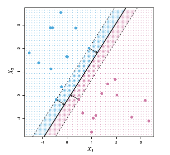

### Hyperplane

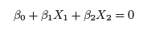

If a point satisfies this condition, it lies on the plane. We assign the observations or yi in the blue side to 1 and those from the purple class to -1.
Then for a separating hyperplane, the following holds:

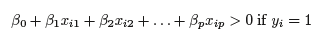

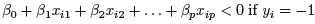

Thus the following will also be held true: 

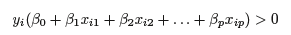

### Maximal Margin Classifier

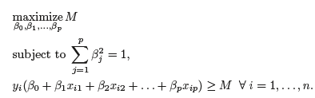

Let's work with dataset linear.csv.

```{r}
data = read.csv("D:/Day 7/linear.csv")
# Remove column X as we don't need it
data$X = NULL
data$y = factor(data$y,
               levels = c(-1,1))
plot = ggplot(data = data, aes(x = x1, y = x2, color = y)) + geom_point() + 
    scale_color_manual(values = c("red", "blue"))

plot
```

Let's try to draw a decision boundary.

```{r}
plot = ggplot(data = data, aes(x = x1, y = x2, color = y)) + geom_point() + 
    scale_color_manual(values = c("red", "blue")) + 
    geom_abline(slope = 1, intercept = 0)

plot
```

Let's try again with a new value of slope

```{r}
plot = ggplot(data = data, aes(x = x1, y = x2, color = y)) + geom_point() + 
    scale_color_manual(values = c("red", "blue")) + 
    geom_abline(slope = 1.3, intercept = 0)

plot
```

Close, but we can do better. Let's now try also to draw the margins:

```{r}
plot = ggplot(data = data, aes(x = x1, y = x2, color = y)) + geom_point() + 
    scale_color_manual(values = c("red", "blue")) + 
    geom_abline(slope = 1.4, intercept = 0)+
    geom_abline(slope = 1.4, intercept = 0.03, linetype = "dashed") +
    geom_abline(slope = 1.4, intercept = -0.03, linetype = "dashed")

plot
```

Well, we see that this margin could be maximized further.

Now, let's fit SVM model. But, before that make a split to get traning and test data.

```{r}
n = nrow(data)
shuffled = data[sample(n),]
train = shuffled[1:round(0.7 * n),]
test = shuffled[(round(0.7 * n) + 1):n,]
```

Fitting SVM model using **e1071** package.

```{r}
library(e1071)
svm_model = svm(y ~ ., data = train, type = "C-classification", kernel = "linear",
                scale = FALSE)
# See model output
svm_model
```

From this model, we can access support vector coordinates, support vector index, coefficients of the support vector (importance).

Support vector coordinates:

```{r}
svm_model$SV
```

Support vector index:

```{r}
svm_model$index
```


Support vector coefficients:

```{r}
svm_model$coefs
```

Test accuracy

```{r}
pred_test = predict(svm_model, test)
mean(pred_test == test$y)
```

### Visualizing support vectors

```{r}
sv = train[svm_model$index,]
p = ggplot(data = train, aes(x = x1, y = x2, color = y)) +
     geom_point() +
     scale_color_manual(values = c("red","green")) + 
    geom_point(data = sv,
                    aes(x = x1, y = x2),
                    color = "purple",
                    size = 5, alpha = 0.4)
p
```

### plot() function

```{r}
plot(x = svm_model, data = train)
```

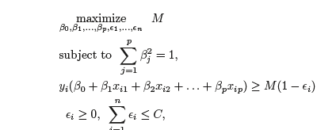

Here epsilons are slack variables that allow individual observations to be on
the wrong side of the margin or the hyperplaneare and C is a nonnegative tuning parameter called Cost. The higher the cost, the narrower the margin.

Now, we will work with radial.csv file.

```{r}
radial = read.csv("D:/Day 7/radial.csv")
radial$X = NULL
radial$y = factor(radial$y,
               levels = c(-1,1))
n = nrow(radial)
shuffled = radial[sample(n),]
train = shuffled[1:round(0.7 * n),]
test = shuffled[(round(0.7 * n) + 1):n,]
```

Let's plot this data

```{r}
p = ggplot(data = radial, aes(x = x1, y = x2, color = y)) + 
     geom_point() + 
     scale_color_manual(values = c("-1" = "red","1" = "blue")) 

p
```

We can see that the data is not lineaarly separable. Even then, we will now fit 
a linear SVM.

```{r}
linear_1 = svm(y ~ ., data = train, type = "C-classification", cost = 1,
                   kernel = "linear", scale = FALSE)

linear_1
```

Let's plot the model

```{r}
plot(linear_1, train)
```

We can see that this model has classified all the points to a single class only.

#### Accuracy

```{r}
test_class = predict(linear_1, test)
mean(test_class == test$y)
```


Now, try the same model with higher cost.

```{r}
linear_2 = svm(y ~ ., data = train, type = "C-classification", cost = 100,
                   kernel = "linear", scale = FALSE)
linear_2
```

Let's plot this new model with higher value of cost.

```{r}
plot(linear_2, train)
```

Like the previous model **model_1**, **model_2** also has classified all the points to a single class only.

Accuracy of the second model

```{r}
test_class = predict(linear_2, test)
mean(test_class == test$y)
```

We see that this is the same as we have found for **model_1**.

### Kernel to rescue

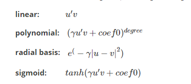

### Tuning the model

```{r}
tuned = 
  tune.svm(x = train[,-3], y = train[,3], 
        type = "C-classification", kernel = "polynomial", degree = 2,
        cost = 10^(-1:3), gamma = c(0.1,1,10, 100), coef0 = c(0.1,1,10, 100))
```

#### Tuned parameters -- best Cost

```{r}
tuned$best.parameters$cost
```

Best gamma

```{r}
tuned$best.parameters$gamma
```

Best coef

```{r}
tuned$best.parameters$coef0
```

Now fit with these tuned parameter values

```{r}
svm_model = svm(y~ ., data = train, type = "C-classification",
        kernel = "polynomial", degree = 2,
        cost = tuned$best.parameters$cost,
        gamma = tuned$best.parameters$gamma,
        coef0 = tuned$best.parameters$coef0)
```

#### Prediction accuracy

```{r}
test_pred = predict(svm_model, test)
mean(test_pred == test$y)
```

SVM plot

```{r}
plot(svm_model, train)
```

### Radial Basis Function Kernels

```{r}
radial = svm(y ~ ., data = train, type = "C-classification", kernel = "radial")
```
Test accuracy

```{r}
test_class = predict(radial, test)
mean(test_class == test$y)
```

Let's plot it

```{r}
plot(radial, train)
```

